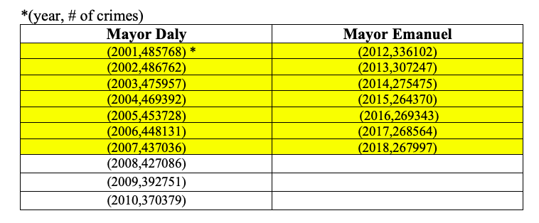

# MSiA 431 Spark HW2
## Zach Zhu
- [EX1](#EX1)
- [EX2](#EX2)
- [EX3](#EX3)
- [EX4](#EX4)


## Repo structure
```
├── README.md                         <- You are here
├── src/                              <- Source code and new dataset for EX3
├── output/                           <- .txt files and plots
```

## EX1
 Crime events mostly happen during the warm seasons (May to October) especially summer time (July and August) then the number drops drastically after October. It seems reasonable since criminals might also be scared of the Chicago winter.  

 > [zhu_1.py](src/zhu_1.py)

 > [zhu_1.txt](output/zhu_1.txt)
  


## EX2
### 2.1
**Top 10 blocks in crime events in the last 3 years (2017, 2018, 2019)**  

> [zhu_2_1.scala](src/zhu_2_1.scala)

> [zhu_2_1.txt](output/zhu_2_1.txt)


### 2.2
The two beats that are adjacent with the highest correlation in the number of crime events: **Beat 1931** and **Beat 1932** with correlation 0.9951.  

> ([zhu_2_2.scala](src/zhu_2_2.scala))

> ([zhu_2_2.txt](output/zhu_2_2.txt))

### 2.3

> ([zhu_2_3.scala](src/zhu_2_3.scala))

1. **Compare the total number of crime events for each year**


- It seems like when Mayor Daly was in the office, there were more crimes events. But since the number is decreasing annually through the whole period no matter who is in the office, we should look at the percent in the drop of the numbers. When Daly was in the office, the number of crime events dropped  by **10.03%** from 2001 to 2007, compared to **20.26%** when Emanuel was the mayor from 2012 to 2018

> ([zhu_2_3_annual_daly.txt](output/zhu_2_3_annual_daly.txt))

> ([zhu_2_3_annual_emanuel.txt](output/zhu_2_3_annual_emanuel.txt))

2. **Compare the average number of crime events for top 10 categories of crime**


- The top 10 crime types are almost the same except the order is a bit different among some categories. The top 3 remained the same but new type THEFT (FROM BUILDING) took place NARCOTICS (POSS: CANNABIS 30GMS OR LESS) becoming the new "popular" crime type when Emanuel was the mayor.

> ([zhu_2_3_daly_iucr.txt](output/zhu_2_3_daly_iucr.txt))

> ([zhu_2_3_emanuel_iucr.txt](output/zhu_2_3_emanuel_iucr.txt))

3. **Compare the average number of crime events for top 10 Beats**


- Two Beats (0823, 0414) were no longer in the top 10 list when the mayer was Emanuel, but two new 1831 and 1834 came up especially 1831 became the No.1 "dangerous" Beat. Usually, the Beats in the south (start with 04, 05, and 06) are considered to be so-called unsafe neighborhoods, but it seems like the situation was changed when Emanuel was the mayor. Another explanation could be that more police force was put in the central Chicago area and more criminals were caught.

> ([zhu_2_3_beat_daly.txt](output/zhu_2_3_daly_beat.txt))

> ([zhu_2_3_beat_emanuel.txt](output/zhu_2_3_emanuel_beat.txt))


## EX3
Used Random Forest model for the forcasting.

- Model Performance RMSE for predicting the weekly number of all crime events at beat level : 7.014053
- Model Performance RMSE for predicting the weekly number of violent crime events at beat level : 0.957999

> ([zhu_3.py](src/zhu_3.py))

> ([zhu_3_all_crime.txt](output/zhu_3_all_crime.txt))

> ([zhu_3_violent_crime.txt](output/zhu_3_violent_crime.txt))


## EX4

> ([zhu_4.py](src/zhu_4.py))

1. **Pattern for Month:** as stated in the question1, criminals are mostly active during warm months. However, the number of crime events with arrest might be a bit different from the average number. First, March has the largest amount of crime events which could explained by that criminals are so sick of the Chicago winter and the spring is finally and let's make some chaos for the city! Second, the number considerably decrease from October to December, then we see a prominent jump in January. This is interesting, and my theory is that after the Christmas break, people get to work so are the police officers, more crime activities are documented.


2. **Pattern for Hour:** Criminals get busy starting from 5am, and the number climbs up all the way to the highest in the evening at around 8pm. It is reasonable as criminals also need sleep so they don’t come out during the night. While in the evening, the light is getting dimmer and people are off from work not staying alert, thus it is the best time for doing some bad things!


3. **Pattern for Week Day:** What is the busiest day of a week? It is Friday! And crime events mostly happen during the mid-week. It looks fair to me since most activities take place on Friday, and on weekend, most people are staying at home and police officers not conducting operations that much comparing to weekdays.

